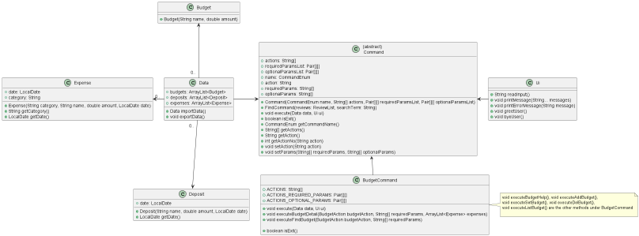

# Developer Guide

## Introduction

Budget Buddy aims to help those who want a Command Line Interface App that is a one-stop solution to keep track of their
expenses, help them with budgeting and also be help them to visualise what they have spent.

Overspending and the lack of savings is a significant problem found in most fresh graduates. We want to create tools
necessary for them so that they can realize their actual spending and achieve financial freedom in the future.

## Setting up the project

## Design

{Describe the design and implementation of the product. Use UML diagrams and short code snippets where applicable.}

### Main Component

In the main (Duke) class, the main method first calls startApplication() which initalizes the Log Manager for logging (
disabled if in production stage) and Ui object for printing output messages. After initialized, it will then attempt to
import the user's data from `data.json`. If there is no file, it will initalize a blank data. If importing fails, the
application will print an error message and exit with code 1. Once done, it will greet the user with a message.

The application then runs an infinite loop to take in and execute commands, until when the inputs `exit` to exit the
application. After which, it will output a bye message and exits the application safely.

### Command Component

The command consists of three components: Enum CommandEnum, Abstract class Command and Class CommandParser. Each of them
plays a role in retrieving the commands input by the user and redirecting to the correct components.

#### CommandEnum

#### Command

#### CommandParser

The `CommandParser` class takes in an input from the `Duke` class as seen in the sequence diagram above. It then parses
the information
to create a command of a specific type (eg `BudgetCommand`, `DepositCommand` , explained in the class diagram above)
based
the input.

## Product scope

### Item Component

The main 3 classes of Duke are the `budget` , `expense` and `deposit` class. Users are able to add, store and visualise
the date relate to each
of these classes. Each of these classes are modelled as an `Item`.

### Budget Component

#### BudgetCommand Class

The `BudgetCommand` class contains methods that are related to the `Budget` function of Duke. Users are able to create
new budgets, which are stored in a budget list. The category word from the user's input is taken from the first word of
the users input,
and the second word of the users input is the action word. The first word is processed through the `CommandParser`
class. If the
Command word is "budget", it will be processed into the `BudgetCommand` class. The action word is then processed into
the `BudgetAction` class.
The class diagram below shows how the `BudgetCommand` parent class is implemented, as well as its extended classes.

#### BudgetCommand Sequence

Once a string `input` from the user has been deemed as a `Budget` command as explained in the `CommandParser` sequence
diagram above,
the `input` will be passed into the `BudgetCommand` class. This class determines what budget commands to carry out to
update the `data` stored in the `Budget` and `Expense` array lists, as shown in the sequence diagram below.

### Deposit Component

### DepositCommand Class

The `DepositCommand` class contains methods that relate to the execution of the deposit functionality in BudgetBuddy.
Users can
create new deposits with a timestamp (if necessary). These deposits are stored in a deposit list and users can delete
deposits, find
deposits using keywords, and list all deposits.

The user's input is split by the parser in the `CommandParser` class and is redirected to the 'DepositCommand' class if
the first word
is "deposit." Based on the second word, a method in `DepositAction` class is called corresponding to the command
requested by the user.

Attached below is how the `DepositCommand` class is implemented along with its relation with the other `Data` classes
and the abstract
`Command` class.

### Design & Implementation of the Deposit Feature

Like all other functionalities of BudgetBuddy, the deposit feature is heavily modularized and designed with an OOP lens.
Because of this,
the parsing of user input, the parsers for each feature, and each feature's actions are all in separate classes.

On a high level, the deposit feature starts with `CommandParser` taking in the input and choosing which `Command` class
to execute from.
This happens with all user input in BudgetBuddy. Then if the first word is "deposit," the `execute` function of
the `DepositCommand` class
will run, creating a new `DepositAction` class. The `execute` function will run a method corresponding to what the user
inputs. The design
of this three class system is meant to modularize the different aspects of the internal logic so future problems would
be encapsulated in a specific location.

### Expense Component

### ExpenseCommand Class

The `ExpenseCommand` class contains methods that relate to the execution of the expense functionality in BudgetBuddy.
Users can
create new expense entries with a timestamp (if necessary). These expenses are then stored in an expense list and users
can delete existing
expenses, find expenses using keywords, and list all expenses according to their categories.

The user input is split by the parser in the `CommandParser` class and is redirected to the `ExpenseCommand` class if
the first word is
"expense". Based on the second command word, a method in `CommandAction` class is called corresponding to the command
entered by the user.

Attached below is how the `ExpenseCommand` class is implemented along with its relation with the other `Data` classes
and the abstract
`Command` class.

### Design & Implementation of the Expense Feature

The expense feature is similarly modularized and designed with an OOP lens. As such, its functionalities have been
separated into different
classes such as the parsing of user input, and the parsing and execution of each of its features.

On a high level, the expense feature starts with `CommandParser` taking in the input and choosing which `Command` class
to execute from.
This happens with all user input in BudgetBuddy. Then, if the first word is "expense", the `execute` function of
the `ExpenseCommand` class
will run, creating a new `ExpenseAction` class. The `execute` function will run a method corresponding to what the user
inputs. The design
of this three class system is meant to modularize the different aspects of the internal logic so future problems would
be encapsulated in
a specific location.

### Stats Component

### StatsCommand Class

The 'StatsCommand' class contains methods that are related to the execution of the stats functionality in BudgetBuddy.
Users can
use this command to view all the details of their expenses, budgets and deposits in the current month. Through this
feature, users will know
their current progress and if their expenses have exceeded their budget. <Add diagram>

### Design & Implementation of the Stats Feature

The stats feature, just like all other features, also is designed and implemented to incorporate good OOP. Therefore,
there are
separate classes for each part of the Stats Feature, which includes StatsAction, StatsUIResponse and StatsCommand.

### Others

#### Exception Component

#### File IO Component

## Appendix A: User Stories

| Version | As a ...       | I want to ...                                                                   | So that I can ...                                                            |
|---------|----------------|---------------------------------------------------------------------------------|------------------------------------------------------------------------------|
| v1.0    | quick user     | enter my inputs immediately rather than clicking and typing                     | have a convenient way of managing my budget                                  |
| v1.0    | new user       | know how to setup my application                                                | use the application and insert my financial data                             |
| v1.0    | forgetful user | get all the commands I can input                                                | know what are the commands available                                         |
| v1.0    | forgetful user | know the syntax for each action                                                 | know how to perform an action                                                |
| v1.0    | careless user  | receive an error message when entering a wrong command                          | rectify my errors in the next input                                          |
| v1.0    | user           | add my monthly budget for a category (eg. transportation, utilities, food etc.) | have an organised view of my overall budget                                  |
| v1.0    | user           | list down my budget for each category                                           | tell if my salary/earnings is sufficient for the total amount of all budgets |
| v1.0    | user           | modify my budget for a category                                                 | allocate more/less budget to a category                                      |
| v1.0    | user           | delete a budget category                                                        | remove a budget category that I wrote the category name wrongly              |
| v1.0    | user           | add in additional deposit from bank interest/investments                        | increase my savings                                                          |
| v1.0    | user           | remove my additional deposits that I added                                      | delete wrong inputs                                                          |
| v1.0    | user           | list down all my additional deposits                                            | tell how much additional deposits I have made in total                       |
| v1.0    | user           | add an expense for an item I have spent on                                      | keep track of what I have spent on and how much I have spent                 |
| v1.0    | user           | set an expense to a category                                                    | organise my expense history and deduct from the selected category            |
| v1.0    | user           | delete an expense                                                               | delete wrong inputs                                                          |
| v1.0    | user           | view my expense history                                                         | see how much I have spent overall                                            |
| v1.0    | user           | view the overall statistics                                                     | know what is my progress on spending and saving for the month                |
| v1.0    | user           | load my deposit, budget and expense data                                        | retain all my information when I launch the application again                | 
| v1.0    | user           | save my deposit, budget and expense data                                        | retain all my information when I launch the application again                |
| v1.0    | leaving user   | know if I exited the application safely                                         | ensure that there are no errors in the application                           |
| v2.0    | careless user  | get all the actions of a command I can input                                    | know what actions are available                                              |
| v2.0    | user           | show the current progress of my budget                                          | check if I have overspent a category                                         |
| v2.0    | user           | show my budget results for a certain month/year                                 | check my past budget results                                                 |
| v2.0    | user           | find deposit(s) based on name                                                   | recall how much I made from a deposit                                        |
| v2.0    | user           | list down my deposits and/or expenses at a date range                           | check my past deposits/expenses that I've added                              |
| v2.0    | user           | list down my expenses based on category                                         | know what I've spent for a specific category                                 | 
| v2.0    | user           | clear deposits and/or expenses at a date range (or all)                         | delete quickly without doing one by one                                      |
| v2.0    | user           | clear expenses based on category                                                | delete quickly without doing one by one                                      |
| v2.0    | user           | display more stats information such as deposits and expenses                    | have a brief overview of a month’s spending                                  |
| v2.0    | user           | view the overall statistics for a certain month/year                            | check my past results                                                        |
| v2.0    | returning user | be reminded of my budget progress when I launch the app                         | realise my progress and minimise my spending                                 |

## Appendix B: Non-Functional Requirements

{Give non-functional requirements}

## Appendix C: Glossary

* *glossary item* - Definition

## Appendix D: Instructions for manual testing

{Give instructions on how to do a manual product testing e.g., how to load sample data to be used for testing}

## Appendix E: Acknowledgements

{list here sources of all reused/adapted ideas, code, documentation, and third-party libraries -- include links to the
original source as well}