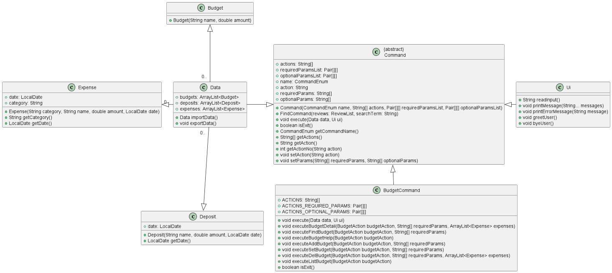

# Developer Guide

## Acknowledgements

{list here sources of all reused/adapted ideas, code, documentation, and third-party libraries -- include links to the
original source as well}

## Design & implementation

{Describe the design and implementation of the product. Use UML diagrams and short code snippets where applicable.}

### Item Classes

The main 3 classes of Duke are the `budget` , `expense` and `deposit` class. Users are able to add, store and visualise
the date relate to each
of these classes. Each of these classes are modelled as an `Item`.

### BudgetCommand Class

The `BudgetCommand` class contains methods that are related to the `Budget` function of Duke. Users are able to create
new budgets, which are stored in a budget list. The category word from the user's input is taken from the first word of
the users input,
and the second word of the users input is the action word. The first word is processed through the `CommandParser`
class. If the
Command word is "budget", it will be processed into the `BudgetCommand` class. The action word is then processed into
the `BudgetAction` class.
The class diagram below shows how the `BudgetCommand` parent class is implemented, as well as its extended classes.

### DepositCommand Class

The `DepositCommand` class contains methods that relate to the execution of the deposit functionality in BudgetBuddy. Users can 
create new deposits with a timestamp (if necessary). These deposits are stored in a deposit list and users can delete deposits, find
deposits using keywords, and list all deposits.

The user's input is split by the parser in the `CommandParser` class and is redirected to the 'DepositCommand' class if the first word
is "deposit." Based on the second word, a method in `DepositAction` class is called corresponding to the command requested by the user.

Attached below is the how the `DepositCommand` class is implemented along with its relation with the other `Data` classes and the abstract
`Command` class.

###Design & Implementation of the Deposit Feature

Like all other functionalities of BudgetBuddy, the deposit feature is heavily modularized and designed with an OOP lens. Because of this, 
the parsing of user input, the parsers for each feature, and each feature's actions are all in separate classes. 

On a high level, the deposit feature starts with `CommandParser` taking in the input and choosing which `Command` class to execute from.
This happens with all user input in BudgetBuddy. Then if the first word is "deposit," the `execute` function of the `DepositCommand` class
will run, creating a new `DepositAction` class. The `execute` function will run a method corresponding to what the user inputs. The design
of this three class system is meant to modularize the different aspects of the internal logic so future problems would be encapsulated in
a specific location.

## Product scope

### Target user profile

Budget Buddy aims to help those who want a Command Line Interface App that is a one-stop solution to keep track of their
expenses, help them with budgeting and also be help them to visualise what they have spent.

### Value proposition

Budget Buddy tries to help people create, store, and edit multiple budgets. The ability to keep the budget on a computer allows
users to keep their budget wherever they'd bring their computer. 

## User Stories

|Version| As a ... | I want to ... | So that I can ...|
|--------|----------|---------------|------------------|
|v1.0|new user|see usage instructions|refer to them when I forget how to use the application|
|v2.0|user|find a to-do item by name|locate a to-do without having to go through the entire list|

## Non-Functional Requirements

{Give non-functional requirements}

## Glossary

* *glossary item* - Definition

## Instructions for manual testing

{Give instructions on how to do a manual product testing e.g., how to load sample data to be used for testing}
